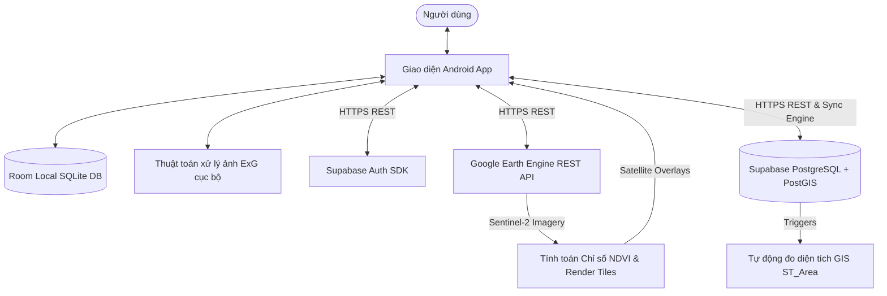

# BÁO CÁO MÔN HỌC: XIMIFARMING MOBILEGIS

## Ứng dụng Quản lý Lô đất & Theo dõi Cây trồng thông minh dựa trên Bản đồ số GIS

XimiFarming MobileGIS là một ứng dụng di động GIS được phát triển trên nền tảng **Android (Java)**, tích hợp các công nghệ bản đồ số hiện đại, phân tích dữ liệu không gian, điện toán đám mây và xử lý ảnh số. Ứng dụng được thiết kế nhằm hỗ trợ người nông dân và các nhà quản lý nông nghiệp phân chia thửa đất, theo dõi sức khỏe cây trồng, tự động hóa tính toán chỉ số vệ tinh NDVI và phân tích mức độ diệp lục trực tiếp thông qua ảnh chụp lá cây ngoại tuyến.

---

## 1. Kiến trúc Hệ thống

Ứng dụng tuân thủ mô hình **Offline-First**, đảm bảo tính khả dụng cao kể cả khi người dùng làm việc tại các vùng sản xuất nông nghiệp không có sóng di động. Khi có kết nối Internet, hệ thống sẽ thực hiện đồng bộ hai chiều (2-way sync) với đám mây.



### Các thành phần chính trong Stack công nghệ:
1. **Client OS & SDK**: Android SDK (Target API 34, Min API 26), Ngôn ngữ lập trình Java.
2. **Cơ sở dữ liệu cục bộ (Local DB)**: [AppDatabase.java](file:///c:/Users/admin/Desktop/mobileGIS/XimiFarming_MobileGIS/app/src/main/java/com/mobilegis/ximifarming/data/AppDatabase.java) xây dựng trên SQLite thông qua thư viện Room, lưu trữ trạng thái offline và lịch sử tác vụ chưa đồng bộ (`isSynced = false`).
3. **Cơ sở dữ liệu đám mây (Cloud DB)**: Supabase (PostgreSQL) kết hợp extension **PostGIS** để lưu trữ thông tin vị trí hình học (Geometry/Geography) của lô đất và cây trồng dưới dạng các đối tượng không gian.
4. **Công nghệ Xử lý ảnh vệ tinh**: REST API của **Google Earth Engine (GEE)** để thu thập ảnh đa phổ từ chùm vệ tinh Copernicus Sentinel-2, xử lý tính toán NDVI trên đám mây và kết xuất thành lớp bản đồ dạng Tile Overlay đè lên Google Maps.
5. **Công nghệ Xử lý ảnh cục bộ**: Thư viện **CameraX** kết hợp thao tác pixel trực tiếp trên Bitmap để tính chỉ số Excess Green Index (ExG).

---

## 2. Thiết kế Cơ sở dữ liệu (Supabase PostGIS vs Room Local)

Để hỗ trợ truy vấn không gian trên đám mây và đồng bộ offline trên client, cấu trúc cơ sở dữ liệu được thiết kế tương đương giữa hệ thống quan hệ PostgreSQL và SQLite. 

Chi tiết Schema SQL trên cloud xem tại [supabase_schema.sql](file:///c:/Users/admin/Desktop/mobileGIS/XimiFarming_MobileGIS/supabase_schema.sql).

### Mô hình các thực thể chính

#### A. Thực thể Lô đất (Plots)
*   **Local Entity**: [Plot.java](file:///c:/Users/admin/Desktop/mobileGIS/XimiFarming_MobileGIS/app/src/main/java/com/mobilegis/ximifarming/data/entity/Plot.java)
*   **Cloud Table**: `plots`
*   **Chi tiết trường dữ liệu**:
    *   `id` (Primary Key): ID kiểu `int` đồng bộ giữa local và cloud.
    *   `name`: Tên lô đất (ví dụ: "Vườn Sầu Riêng A1").
    *   `coordinates_json`: Chuỗi JSON lưu danh sách các điểm tọa độ đa giác để render lên Google Maps cục bộ.
    *   `geom` (Chỉ có trên Cloud): Kiểu dữ liệu không gian `geometry(Polygon, 4326)`. Cho phép thực hiện các truy vấn không gian trực tiếp (ví dụ: kiểm tra cây trồng có nằm trong lô đất không).
    *   `area`: Diện tích lô đất (m²). Trên Cloud, giá trị này tự động tính toán qua trigger PostgreSQL:
        ```sql
        NEW.area := ST_Area(NEW.geom::geography);
        ```
    *   `avg_ndvi`: Chỉ số thực vật trung bình được trả về từ GEE hoặc mock mode.
    *   `health_status`: Trạng thái sức khỏe lô đất (Tốt, Cảnh báo, Nguy cơ) - điều khiển màu sắc hiển thị nét vẽ đa giác.
    *   `owner_id`: Khóa ngoại liên kết với bảng xác thực người dùng `auth.users` của Supabase.
    *   `is_synced` (Chỉ có ở Local): Cờ đánh dấu bản ghi đã được đẩy lên đám mây thành công hay chưa.

#### B. Thực thể Cây trồng (Crops)
*   **Local Entity**: [Crop.java](file:///c:/Users/admin/Desktop/mobileGIS/XimiFarming_MobileGIS/app/src/main/java/com/mobilegis/ximifarming/data/entity/Crop.java)
*   **Cloud Table**: `crops`
*   **Chi tiết trường dữ liệu**:
    *   `id` (Primary Key): ID duy nhất kiểu `int`.
    *   `plot_id`: Khóa ngoại liên kết tới Lô đất chứa cây trồng này.
    *   `name`: Tên hoặc mã cây trồng (ví dụ: "SR-001").
    *   `latitude`, `longitude`: Tọa độ điểm để vẽ Marker trên bản đồ.
    *   `geom` (Chỉ có trên Cloud): Kiểu dữ liệu không gian `geometry(Point, 4326)`.
    *   `status`: Tình trạng sinh trưởng (Khỏe mạnh, Stress, Nhiễm bệnh).

#### C. Thực thể Nhật ký Chăm sóc (Crop Logs)
*   **Local Entity**: [CropLog.java](file:///c:/Users/admin/Desktop/mobileGIS/XimiFarming_MobileGIS/app/src/main/java/com/mobilegis/ximifarming/data/entity/CropLog.java)
*   **Cloud Table**: `crop_logs`
*   **Chi tiết trường dữ liệu**:
    *   `id` (Primary Key): ID kiểu `int`.
    *   `crop_id`: Khóa ngoại liên kết tới Cây trồng.
    *   `note`: Nội dung ghi chú công việc hoặc tình trạng cụ thể.
    *   `photo_path` (Local) / `photo_url` (Cloud): Đường dẫn ảnh chụp kiểm tra lá cây / Đường dẫn ảnh trên Cloud Storage.
    *   `created_at`: Thời gian ghi nhận nhật ký.

---

## 3. Các Giải pháp Kỹ thuật và Thuật toán Tiêu biểu

### 3.1. Thuật toán Đồng bộ dữ liệu hai chiều & Bảo vệ ràng buộc dữ liệu (Cascade Protection)
Một trong những thách thức lớn của mô hình Offline-First là việc ánh xạ lại ID (ID Translation). Khi một bản ghi được tạo ngoại tuyến, nó nhận một ID cục bộ tự tăng (ví dụ: `id = 1`). Khi kết nối mạng và đẩy lên Supabase, đám mây trả về một ID chính thức (ví dụ: `id = 105`).
*   **Vấn đề**: Việc cập nhật ID cha (Plot) từ `1` thành `105` trong Room Database nếu thực hiện bằng cách xóa bản ghi cũ và chèn bản ghi mới sẽ kích hoạt quy tắc `ON DELETE CASCADE`, xóa sạch toàn bộ các Cây trồng (`crops`) và Nhật ký chăm sóc (`crop_logs`) liên quan đang lưu ở cục bộ.
*   **Giải pháp**: [SupabaseClient.java](file:///c:/Users/admin/Desktop/mobileGIS/XimiFarming_MobileGIS/app/src/main/java/com/mobilegis/ximifarming/supabase/SupabaseClient.java) triển khai giải pháp chuyển giao liên kết khóa ngoại an toàn trong một Database Transaction (`db.runInTransaction`):
    1.  Tải lên bản ghi cha (Plot) -> Nhận ID trực tuyến mới từ Supabase.
    2.  Truy vấn toàn bộ các thực thể con (Crop) mang khóa ngoại trỏ tới ID cũ (`plot_id = 1`).
    3.  Chèn bản ghi cha mới với ID trực tuyến mới (`id = 105`) và đặt `isSynced = true`.
    4.  Cập nhật khóa ngoại của toàn bộ thực thể con sang ID trực tuyến mới (`plot_id = 105`).
    5.  Xóa bản ghi cha cũ (`id = 1`). Do các đối tượng con đã được chuyển giao sang ID cha mới, việc xóa bản ghi cũ không kích hoạt CASCADE làm mất dữ liệu.

### 3.2. Tích hợp phân tích ảnh vệ tinh GEE & Bộ đệm RAM (LruCache) cho Map Tiles
Ứng dụng gọi REST API của Google Earth Engine để lấy thông tin ảnh vệ tinh đa phổ Sentinel-2 trong khu vực lô đất. Earth Engine xử lý thuật toán tính NDVI:
$$\text{NDVI} = \frac{\text{NIR} - \text{Red}}{\text{NIR} + \text{Red}} = \frac{\text{B8} - \text{B4}}{\text{B8} + \text{B4}}$$
Kết quả tính toán trả về một Tile URL chứa các mảnh ảnh PNG theo chuẩn `{z}/{x}/{y}`.
*   **Vấn đề**: Khi người dùng trượt hoặc zoom bản đồ, Google Maps liên tục yêu cầu nạp ảnh tile. Việc đọc I/O từ bộ nhớ trong hoặc tải lại từ mạng gây trễ, tạo ra cảm giác giật lag giao diện (giảm FPS).
*   **Giải pháp**: [EarthEngineTileProvider.java](file:///c:/Users/admin/Desktop/mobileGIS/XimiFarming_MobileGIS/app/src/main/java/com/mobilegis/ximifarming/gee/EarthEngineTileProvider.java) tích hợp một bộ đệm tĩnh `LruCache<String, byte[]>` dung lượng 128 mảnh ảnh trên bộ nhớ RAM. Khi bản đồ yêu cầu một tile, hệ thống kiểm tra RAM trước: nếu có (Cache Hit), dữ liệu byte ảnh được trả về lập tức trong vài micro-giây; nếu không có (Cache Miss), ảnh mới được đọc từ đĩa hoặc tải từ mạng và ghi vào cache. Kết quả giúp bản đồ chuyển động mượt mà đạt chuẩn 60fps.

### 3.3. Thuật toán phân tích độ xanh của lá cây ngoại tuyến (Excess Green Index - ExG)
Nhằm hỗ trợ chẩn đoán sức khỏe cây trồng trực tiếp tại ruộng không có Internet, ứng dụng sử dụng Camera để chụp lá cây và chạy thuật toán phân tích phổ màu Excess Green (ExG):
$$\text{ExG} = 2 \times G - R - B$$
Trong đó $R, G, B$ là giá trị cường độ màu đỏ, xanh lá, và xanh dương chuẩn hóa của từng pixel ảnh lá cây.
*   **Quy trình tính toán**:
    1.  Ảnh chụp từ camera được resize về kích thước phân tích phù hợp (ví dụ: $300 \times 400$ pixel) để tối ưu hóa bộ nhớ và tốc độ xử lý.
    2.  Vòng lặp duyệt qua từng pixel của Bitmap, trích xuất giá trị màu gốc $R_{raw}, G_{raw}, B_{raw}$ trong dải $[0, 255]$.
    3.  Tính toán các tỷ lệ chuẩn hóa:
        $$r = \frac{R}{R+G+B}, \quad g = \frac{G}{R+G+B}, \quad b = \frac{B}{R+G+B}$$
    4.  Tính toán chỉ số ExG: $ExG\_val = 2 \times g - r - b$.
    5.  Ánh xạ giá trị ExG thu được sang bảng màu (Color Palette):
        *   Nếu $ExG\_val > 0.1$ (Lá xanh tốt, nhiều diệp lục): Biểu diễn bằng các sắc độ xanh lá sáng dần.
        *   Nếu $ExG\_val \le 0.1$ (Lá úa vàng, thiếu chất dinh dưỡng hoặc bị bệnh): Biểu diễn bằng sắc độ màu vàng đến đỏ đậm.
    6.  Tạo ra một ảnh Heatmap mới đè lên ảnh gốc để hiển thị rõ vùng lá bị tổn thương.

---

## 4. Hướng dẫn Cài đặt & Cấu hình Hệ thống

### 4.1. Cấu hình Khóa API Google Maps
1.  Truy cập [Google Cloud Console](https://console.cloud.google.com/), kích hoạt **Maps SDK for Android**.
2.  Tạo thông tin xác thực **API Key**.
3.  Tạo tệp [local.properties](file:///c:/Users/admin/Desktop/mobileGIS/XimiFarming_MobileGIS/local.properties) tại thư mục gốc của dự án và khai báo khóa:
    ```properties
    MAPS_API_KEY=AIzaSy...YourMapsApiKeyHere...
    ```

### 4.2. Cấu hình Google Earth Engine (GEE) REST API
1.  Đăng ký tài khoản và dự án của bạn sử dụng dịch vụ **Google Earth Engine**.
2.  Tạo một **Service Account** trong IAM của Google Cloud Platform và cấp quyền truy cập tài nguyên Earth Engine.
3.  Tạo khóa tài khoản dịch vụ dạng tệp **JSON**.
4.  Lưu tệp JSON này vào dự án Android tại đường dẫn:
    `app/src/main/assets/service_account_key.json`

*(Lưu ý: Nếu không có file này hoặc thiết bị ngoại tuyến, ứng dụng sẽ chạy ở chế độ **Mock GEE Mode**, tự động vẽ bản đồ nhiệt giả lập lên thửa đất để đảm bảo tính năng giao diện hoạt động bình thường).*

### 4.3. Cấu hình Cơ sở dữ liệu Supabase
1.  Tạo một dự án mới trên [Supabase](https://supabase.com/).
2.  Kích hoạt phần mở rộng **PostGIS** trong cơ sở dữ liệu của bạn:
    ```sql
    CREATE EXTENSION IF NOT EXISTS postgis;
    ```
3.  Nhập mã nguồn SQL tại tệp [supabase_schema.sql](file:///c:/Users/admin/Desktop/mobileGIS/XimiFarming_MobileGIS/supabase_schema.sql) vào trình biên dịch SQL (SQL Editor) của Supabase để khởi tạo cấu trúc bảng, các trigger tự động tính diện tích, và thiết lập chính sách bảo mật Row Level Security (RLS).
4.  Lấy thông tin `SUPABASE_URL` và `SUPABASE_ANON_KEY` tại mục cấu hình API của dự án Supabase.
5.  Thêm các thông tin trên vào tệp [local.properties](file:///c:/Users/admin/Desktop/mobileGIS/XimiFarming_MobileGIS/local.properties) của dự án Android:
    ```properties
    SUPABASE_URL=https://your-project-id.supabase.co
    SUPABASE_ANON_KEY=eyJhbGciOiJIUzI1NiIsInR5cCI6IkpXVCJ9...your-anon-key...
    ```

---

## 5. Môi trường phát triển & Biên dịch

*   **IDE**: Android Studio Jellyfish (2023.3.1) trở lên hoặc các phiên bản tương thích Gradle 9.
*   **JDK**: Phiên bản **Java 17 / Java 21** (Đã được cấu hình cứng trong [gradle.properties](file:///c:/Users/admin/Desktop/mobileGIS/XimiFarming_MobileGIS/gradle.properties) trỏ đến JDK JBR đi kèm Android Studio để tránh xung đột phiên bản JDK hệ thống).
*   **Gradle**: Phiên bản 9.0.0.
*   **Thiết bị chạy**: Android API 26 (Android 8.0) trở lên, yêu cầu dịch vụ Google Play Services để chạy bản đồ Google Maps.

### Các lệnh biên dịch hữu ích (chạy từ terminal):
*   **Biên dịch mã Java**:
    ```powershell
    .\gradlew compileDebugJavaWithJavac
    ```
*   **Đóng gói file cài đặt (APK)**:
    ```powershell
    .\gradlew assembleDebug
    ```
    *File APK sau khi build thành công sẽ nằm ở:* `app/build/outputs/apk/debug/app-debug.apk`
