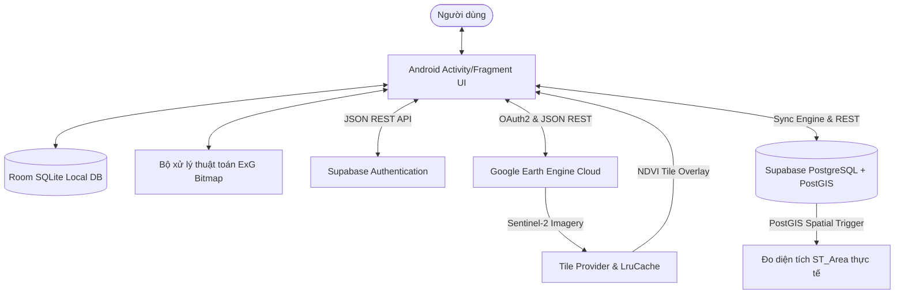

# BÁO CÁO KỸ THUẬT DỰ ÁN: XIMIFARMING MOBILEGIS

## Ứng dụng Di động GIS Quản lý Lô đất & Theo dõi Sức khỏe Cây trồng Thông minh

Dự án này là một ứng dụng di động chạy trên hệ điều hành **Android (Java)**, được xây dựng phục vụ việc số hóa, phân chia ranh giới thửa đất, giám sát sinh trưởng cây trồng dựa trên dữ liệu không gian, điện toán đám mây và xử lý ảnh số. 

Ứng dụng kết hợp sức mạnh của **Google Earth Engine (GEE)** để xử lý ảnh vệ tinh đa phổ Sentinel-2 tính toán chỉ số NDVI trực tuyến, kết hợp hệ quản trị cơ sở dữ liệu **Supabase (PostgreSQL + PostGIS)** để đồng bộ hóa thời gian thực, và thuật toán **Excess Green Index (ExG)** cục bộ giúp chẩn đoán sức khỏe lá cây ngoại tuyến.

---

## MỤC LỤC

1. [Kiến trúc Tổng quan hệ thống](#1-kiến-trúc-tổng-quan-hệ-thống)
2. [Cấu trúc thư mục nguồn & Phân vai Package](#2-cấu-trúc-thư-mục-nguồn--phân-vai-package)
3. [Thiết kế Cơ sở dữ liệu Không gian (Local Room vs Cloud PostGIS)](#3-thiết-kế-cơ-sở-dữ-liệu-không-gian-local-room-vs-cloud-postgis)
4. [Hệ thống Xác thực Người dùng (Supabase Auth Framework)](#4-hệ-thống-xác-thực-người-dùng-supabase-auth-framework)
5. [Động cơ Đồng bộ hai chiều (Offline-First 2-Way Sync Engine)](#5-động-cơ-đồng-bộ-hai-chiều-offline-first-2-way-sync-engine)
6. [Tích hợp Điện toán Ảnh vệ tinh Google Earth Engine (GEE)](#6-tích-hợp-điện-toán-ảnh-vệ-tinh-google-earth-engine-gee)
7. [Thuật toán phân tích phổ màu lá cây cục bộ ExG (Excess Green Index)](#7-thuật-toán-phân-tích-phổ-màu-lá-cây-cục-bộ-exg-excess-green-index)
8. [Hướng dẫn Thiết lập & Triển khai Hệ thống](#8-hướng-dẫn-thiết-lập--triển-khai-hệ-thống)
9. [Nhật ký Xử lý lỗi phát sinh (Troubleshooting)](#9-nhật-ký-xử-lý-lỗi-phát-sinh-troubleshooting)

---

## 1. Kiến trúc Tổng quan hệ thống

XimiFarming MobileGIS tuân thủ nghiêm ngặt mô hình thiết kế **Offline-First**. Ứng dụng sử dụng cơ sở dữ liệu Room cục bộ làm nguồn dữ liệu chuẩn (Single Source of Truth) cho giao diện người dùng. Tiến trình đồng bộ hóa chạy nền sẽ đẩy dữ liệu chưa đồng bộ lên Cloud và tải các cập nhật mới nhất từ Cloud xuống khi có mạng.



---

## 2. Cấu trúc thư mục nguồn & Phân vai Package

Mã nguồn Java của ứng dụng được tổ chức khoa học trong package `com.mobilegis.ximifarming`:

```
com.mobilegis.ximifarming
│
├── MainActivity.java                # Hoạt động chính, quản lý vòng đời và điều phối Bottom Navigation
│
├── data                             # Quản trị cơ sở dữ liệu SQLite cục bộ (Room DB)
│   ├── AppDatabase.java             # Room database holder, quản lý phiên bản (Migration)
│   ├── dao                          # Data Access Objects (Định nghĩa các câu lệnh SQL truy vấn)
│   │   ├── CropDao.java
│   │   ├── CropLogDao.java
│   │   └── PlotDao.java
│   └── entity                       # Định nghĩa cấu trúc bảng cục bộ (Room Entities)
│       ├── Crop.java
│       ├── CropLog.java
│       └── Plot.java
│
├── gee                              # Xử lý điện toán ảnh vệ tinh Google Earth Engine
│   ├── EarthEngineClient.java       # Xác thực JWT Service Account, gọi API tính toán NDVI trung bình
│   └── EarthEngineTileProvider.java # Tải động ảnh lớp phủ NDVI, quản lý bộ nhớ đệm RAM (LruCache)
│
├── supabase                         # Động cơ đồng bộ và kết nối API Supabase đám mây
│   └── SupabaseClient.java          # Xử lý Đăng nhập/Đăng ký, Upload ảnh Storage, Đồng bộ 2 chiều (Sync)
│
├── ui                               # Các thành phần giao diện người dùng (User Interface)
│   ├── alerts                       # Tab cảnh báo sâu bệnh và chỉ số NDVI
│   │   └── AlertsFragment.java
│   ├── auth                         # Màn hình xác thực tài khoản
│   │   └── LoginActivity.java
│   ├── components                   # Các View tùy chỉnh vẽ biểu đồ
│   │   └── CustomChartView.java     # Vẽ biểu đồ đường thể hiện biến động chỉ số NDVI theo thời gian
│   ├── crops                        # Quản lý cây trồng và nhật ký chăm sóc cây
│   │   └── CropDetailActivity.java
│   ├── map                          # Giao diện chính chứa bản đồ số Google Maps
│   │   └── MapFragment.java         # Vẽ đa giác thửa đất, chọn gốc cây, hiển thị Overlay ảnh vệ tinh GEE
│   ├── plots                        # Danh sách và chi tiết lô đất
│   │   ├── PlotDetailActivity.java
│   │   └── PlotsFragment.java
│   └── tasks                        # Tab quản lý công việc nông nghiệp ngầm định
│       └── TasksFragment.java
│
└── utils                            # Các thư viện hỗ trợ xử lý hình học và định dạng dữ liệu
    └── GisHelper.java               # Tính diện tích đa giác cục bộ, chuyển đổi dữ liệu tọa độ
```

---

## 3. Thiết kế Cơ sở dữ liệu Không gian (Local Room vs Cloud PostGIS)

Để phục vụ quản lý thông tin không gian (thửa đất đa giác và gốc cây dạng điểm), hệ thống thiết lập hai cơ chế lưu trữ song song:

### 3.1. Cơ sở dữ liệu cục bộ (Room SQLite)
Do SQLite không hỗ trợ sẵn các kiểu dữ liệu không gian phức tạp như Polygon hay Point, dữ liệu hình học được lưu trữ dưới dạng chuỗi văn bản thuần (JSON Text):
*   **Lô đất (Plot)**: Tọa độ ranh giới thửa đất lưu trong trường `coordinatesJson` dưới dạng mảng JSON các đỉnh đa giác `[{"latitude":10.5,"longitude":105.3}, ...]`.
*   **Cây trồng (Crop)**: Vị trí tọa độ lưu trong hai trường số thực độ chính xác kép `latitude` và `longitude`.

### 3.2. Cơ sở dữ liệu đám mây (Supabase PostgreSQL + PostGIS)
Khi dữ liệu được đẩy lên cloud, hệ quản trị PostgreSQL sử dụng extension **PostGIS** giúp kích hoạt các trường dữ liệu không gian thực thụ:
*   **Bảng `plots`**: 
    *   Trường `geom` kiểu dữ liệu `geometry(Polygon, 4326)`.
    *   Sử dụng truy vấn GIS để chuyển đổi tọa độ gửi lên từ client:
        ```sql
        ST_GeomFromText('POLYGON((105.3 10.5, 105.4 10.5, 105.4 10.6, 105.3 10.6, 105.3 10.5))', 4326)
        ```
    *   **Trigger đo diện tích tự động**: Thiết lập một trigger lắng nghe sự kiện `BEFORE INSERT OR UPDATE` để tính diện tích chuẩn không gian thực tế (m²) dựa trên hình cầu WGS84:
        ```sql
        CREATE OR REPLACE FUNCTION calculate_plot_area()
        RETURNS TRIGGER AS $$
        BEGIN
            NEW.area_sq_meters := ST_Area(NEW.geom::geography);
            RETURN NEW;
        END;
        $$ LANGUAGE plpgsql;

        CREATE TRIGGER trigger_calculate_area
        BEFORE INSERT OR UPDATE ON plots
        FOR EACH ROW
        EXECUTE FUNCTION calculate_plot_area();
        ```
*   **Bảng `crops`**:
    *   Trường `geom` kiểu dữ liệu `geometry(Point, 4326)` được xây dựng tự động từ vĩ độ và kinh độ của cây trồng.

### 3.3. Cơ chế phân quyền Row Level Security (RLS)
Để bảo mật dữ liệu giữa các hộ nông dân khác nhau, Supabase bật tính năng RLS trên tất cả các bảng. Mỗi hàng dữ liệu có cột `owner_id` liên kết với ID người dùng đăng nhập (`auth.uid()`). Chính sách RLS chỉ cho phép đọc/ghi khi người dùng là chủ sở hữu:
```sql
ALTER TABLE plots ENABLE ROW LEVEL SECURITY;

CREATE POLICY "Allow owners to manage plots"
ON plots FOR ALL
TO authenticated
USING (owner_id = auth.uid())
WITH CHECK (owner_id = auth.uid());
```

---

## 4. Hệ thống Xác thực Người dùng (Supabase Auth Framework)

Hệ thống xác thực được triển khai tại [LoginActivity.java](file:///c:/Users/admin/Desktop/mobileGIS/XimiFarming_MobileGIS/app/src/main/java/com/mobilegis/ximifarming/ui/auth/LoginActivity.java) và tích hợp qua [SupabaseClient.java](file:///c:/Users/admin/Desktop/mobileGIS/XimiFarming_MobileGIS/app/src/main/java/com/mobilegis/ximifarming/supabase/SupabaseClient.java).

```
[LoginActivity Form] ──(Email/Mật khẩu)──> [Supabase Auth REST API]
                                                 │
                                                 ▼ (Phản hồi JSON)
[Lưu cục bộ SharedPreferences] <──(Access Token)─┘
```

### 4.1. Luồng đăng ký / Đăng nhập
*   **Đăng ký (Sign Up)**: Gửi request `POST` đến endpoint `/auth/v1/signup` kèm payload chứa email và mật khẩu của người dùng.
*   **Đăng nhập (Sign In)**: Gửi request `POST` đến endpoint `/auth/v1/token?grant_type=password`. Khi thành công, API trả về Access Token dưới dạng JSON Web Token (JWT).
*   **Quản lý phiên làm việc (Session)**: Access Token được lưu cục bộ trong `SharedPreferences` của thiết bị. Mỗi khi khởi động ứng dụng, [MainActivity.java](file:///c:/Users/admin/Desktop/mobileGIS/XimiFarming_MobileGIS/app/src/main/java/com/mobilegis/ximifarming/MainActivity.java) kiểm tra sự tồn tại của token này để quyết định có chuyển hướng người dùng về màn hình đăng nhập hay không.

### 4.2. Cơ chế xử lý lỗi hết hạn Token (JWT Expired / 401 Unauthorized)
Access Token của Supabase mặc định hết hạn sau 1 giờ. Nếu client tiếp tục sử dụng token đã hết hạn để gọi API đồng bộ hoặc xóa dữ liệu, máy chủ sẽ trả về lỗi **HTTP 401 Unauthorized**. 

Để xử lý việc này:
*   Mọi cuộc gọi mạng trong ứng dụng (ví dụ: xoá thửa đất) đều được bọc trong bộ lọc phản hồi. Nếu phát hiện mã lỗi `401`, ứng dụng sẽ tự động gọi lệnh:
    ```java
    SharedPreferences pref = getSharedPreferences("XimiFarmingPrefs", MODE_PRIVATE);
    pref.edit().clear().apply(); // Xóa sạch session cũ
    SupabaseClient.getInstance().setAccessToken(null);
    ```
*   Đồng thời hiển thị thông báo "Phiên làm việc hết hạn" và kích hoạt Intent chuyển hướng người dùng lập tức về màn hình `LoginActivity` để làm mới token.

---

## 5. Động cơ Đồng bộ hai chiều (Offline-First 2-Way Sync Engine)

Động cơ đồng bộ hóa được tích hợp tại phương thức `syncData(...)` của [SupabaseClient.java](file:///c:/Users/admin/Desktop/mobileGIS/XimiFarming_MobileGIS/app/src/main/java/com/mobilegis/ximifarming/supabase/SupabaseClient.java).

```
                      [ BẮT ĐẦU ĐỒNG BỘ (syncData) ]
                                    │
                                    ▼
       ┌────────────────────────────────────────────────────────┐
       │                 Bước 1: CHIỀU XUỐNG (PULL)             │
       │  Tải tất cả Plots & Crops từ Cloud về máy.             │
       │  Nếu bản ghi chưa có ở local -> Chèn mới (isSynced=1)   │
       │  Nếu đã có -> Cập nhật thông tin mới nhất (isSynced=1)  │
       └────────────────────────────────────────────────────────┘
                                    │
                                    ▼
       ┌────────────────────────────────────────────────────────┐
       │                 Bước 2: CHIỀU LÊN (PUSH)               │
       │  Quét SQLite tìm các bản ghi mang cờ `isSynced = false`│
       │  Đẩy các bản ghi cha (Plot) mới lên Cloud.             │
       │  Đổi ID cục bộ sang ID trực tuyến của Cloud.           │
       │  Cập nhật khoá ngoại của các bản ghi con liên quan.     │
       └────────────────────────────────────────────────────────┘
```

### 5.1. Thuật toán dịch chuyển ID và Chống lỗi Cascade (ID Translation Algorithm)
Khi chèn dữ liệu offline, Room SQLite sinh ra các khóa tự tăng dạng số nguyên tuần tự (ví dụ: `oldId = 1`). Tuy nhiên, khi đẩy lên Supabase, cơ sở dữ liệu PostgreSQL sẽ tạo ra một khóa ID chính thức không trùng lặp (ví dụ: `newId = 159`).
*   **Rủi ro**: Nếu cập nhật ID lô đất trực tiếp từ `1` thành `159` bằng cách thực hiện `DELETE` bản ghi cũ rồi `INSERT` bản ghi mới, cơ chế `ON DELETE CASCADE` trong SQLite sẽ lập tức xóa sạch toàn bộ các gốc cây (Crops) và nhật ký liên quan (Crop Logs) thuộc lô đất này.
*   **Giải pháp thực hiện trong Transaction**:
    ```java
    db.runInTransaction(() -> {
        // 1. Lưu giữ danh sách các đối tượng con đang trỏ tới ID cũ
        List<Crop> crops = db.cropDao().getCropsForPlot(oldPlotId);
        
        // 2. Tạo đối tượng cha mới mang ID trực tuyến nhận từ Cloud
        Plot newPlot = new Plot(plot.getName(), ...);
        newPlot.setId(newSupabaseId);
        newPlot.setSynced(true);
        db.plotDao().insert(newPlot); // Chèn đối tượng cha mới vào DB
        
        // 3. Cập nhật trường khoá ngoại của toàn bộ đối tượng con sang ID mới
        for (Crop c : crops) {
            c.setPlotId(newSupabaseId);
            db.cropDao().update(c);
        }
        
        // 4. Xóa đối tượng cha mang ID cũ ra khỏi cơ sở dữ liệu
        db.plotDao().delete(plot); 
    });
    ```
Nhờ thuật toán này, liên kết dữ liệu luôn được toàn vẹn và không xảy ra hiện tượng mất mát dữ liệu con khi đồng bộ.

---

## 6. Tích hợp Điện toán Ảnh vệ tinh Google Earth Engine (GEE)

Điện toán đám mây GEE được sử dụng để phân tích dữ liệu chỉ số thực vật phổ vệ tinh NDVI.

### 6.1. Phương thức Xác thực OAuth2 qua Service Account
Do ứng dụng chạy trên thiết bị di động của nông dân, việc yêu cầu từng người dùng đăng nhập tài khoản Google Developer là bất khả thi. Vì vậy, ứng dụng sử dụng phương pháp **Service Account Web Flow**:
*   Tệp cấu hình bảo mật `service_account_key.json` chứa Private Key dạng RSA được lưu trong thư mục `assets` của dự án.
*   Lớp [EarthEngineClient.java](file:///c:/Users/admin/Desktop/mobileGIS/XimiFarming_MobileGIS/app/src/main/java/com/mobilegis/ximifarming/gee/EarthEngineClient.java) sẽ đọc khóa bí mật này, sinh mã ký JWT (JSON Web Token), rồi gửi yêu cầu lấy token OAuth2 tạm thời có thời hạn 3600 giây từ máy chủ xác thực của Google:
    ```
    https://oauth2.googleapis.com/token
    ```

### 6.2. Thuật toán và Payload tính toán NDVI trung bình
Sau khi lấy được OAuth2 Token, ứng dụng gửi một yêu cầu tính toán dạng REST Request chứa biểu thức JSON của Earth Engine để thực hiện:
1.  Lọc chùm ảnh `COPERNICUS/S2_SR` (Sentinel-2 Surface Reflectance) trong khoảng thời gian gần nhất (3 tháng qua).
2.  Lọc không gian theo đa giác ranh giới thửa đất gửi lên từ Client.
3.  Tính toán biểu thức ảnh NDVI dựa trên Band 8 (Near-Infrared - NIR) và Band 4 (Red):
    $$\text{NDVI} = \frac{\text{B8} - \text{B4}}{\text{B8} + \text{B4}}$$
4.  Thực hiện giảm vùng (ReduceRegion) bằng hàm tính trung bình (`ee.Reducer.mean()`) để lấy ra một con số thực duy nhất đại diện cho độ xanh và sức khỏe của cả thửa đất.

### 6.3. Tối ưu hóa Bản đồ phủ ảnh vệ tinh qua bộ nhớ đệm RAM (LruCache)
Lớp [EarthEngineTileProvider.java](file:///c:/Users/admin/Desktop/mobileGIS/XimiFarming_MobileGIS/app/src/main/java/com/mobilegis/ximifarming/gee/EarthEngineTileProvider.java) chịu trách nhiệm lấy và nạp các mảnh ảnh (Map Tiles) NDVI từ GEE.
*   **Sử dụng static LruCache**: 
    ```java
    private static final LruCache<String, byte[]> tileCache = new LruCache<>(128);
    ```
    Khi Google Maps yêu cầu nạp mảnh ảnh tại vị trí tọa độ thửa đất, nhà phát triển kiểm tra khóa đệm bằng cách nối chuỗi các tham số tọa độ mảnh: `key = z + "_" + x + "_" + y`.
    *   **Cache Hit**: Nếu mảng byte ảnh đã có trong Cache, lập tức trả về dữ liệu để bản đồ render, tránh trễ thời gian đọc ghi bộ nhớ thiết bị.
    *   **Cache Miss**: Thực hiện đọc file lưu tạm từ bộ đệm của ổ đĩa hoặc gọi request tải ảnh từ GEE, sau đó lưu mảng byte vào `tileCache` cho lần yêu cầu tiếp theo.
*   **Tối ưu độ trong suốt (Transparency)**: Độ trong suốt của lớp phủ ảnh vệ tinh NDVI được đặt ở mức `0.35f` (35%). Tỷ lệ này đảm bảo người dùng có thể nhìn thấy rõ ranh giới nét vẽ thửa đất màu đỏ/cam/xanh lá cùng nền đường giao thông phía dưới của Google Maps, trong khi vẫn nhận biết được sự thay đổi màu sắc biểu thị mức độ phát triển của cây trồng.

---

## 7. Thuật toán phân tích phổ màu lá cây cục bộ ExG (Excess Green Index)

Triển khai thuật toán xử lý ảnh trên ma trận pixel Bitmap của thiết bị di động để đo đạc mật độ chất diệp lục có trong lá cây mà không cần mạng Internet.

### 7.1. Công thức Toán học
Chỉ số Excess Green Index (ExG) là một trong những chỉ số phổ biến nhất dùng để tách biệt vùng thực vật xanh khỏi nền đất hoặc các yếu tố nhiễu khác. Công thức tính ExG cho từng pixel màu:

$$\text{ExG} = 2 \times g - r - b$$

Trong đó, các giá trị kênh màu chuẩn hóa $r, g, b$ được tính từ giá trị RGB gốc của pixel màu:

$$r = \frac{R}{R+G+B}, \quad g = \frac{G}{R+G+B}, \quad b = \frac{B}{R+G+B}$$

Với $R, G, B \in [0, 255]$ là các giá trị trích xuất từ mã màu pixel của Bitmap.

### 7.2. Logic phân tích ảnh và ánh xạ bảng màu (False-Color Map)
*   **Trích xuất Pixel**: Duyệt qua từng tọa độ hàng và cột của Bitmap ảnh lá cây bằng phương thức `bitmap.getPixels(...)`.
*   **Tính toán ExG**: Thực hiện tính toán chỉ số ExG cho từng pixel ảnh.
*   **Chẩn đoán bệnh/thiếu chất**:
    *   Nếu chỉ số $ExG > 0.1$, pixel đó biểu thị tế bào lá cây chứa nhiều diệp lục, sinh trưởng bình thường. Hệ thống ánh xạ pixel đó sang sắc độ xanh lá cây tươi sáng (`#3DDC84`).
    *   Nếu chỉ số $ExG \le 0.1$, pixel biểu thị vùng lá cây bị úa vàng, thiếu diệp lục hoặc hoại tử do sâu bệnh. Hệ thống ánh xạ pixel đó sang sắc độ đỏ đậm (`#FF0000`) hoặc cam.
*   **Kết xuất ảnh nhiệt (ExG Heatmap)**: Kết quả tạo ra một ảnh Bitmap mới đè lên ảnh gốc. Các khu vực bị nhiễm bệnh hoặc thiếu dinh dưỡng trên lá cây sẽ nổi bật lên với sắc tố màu đỏ, giúp nông dân dễ dàng nhận biết vùng cần chăm sóc đặc biệt.

---

## 8. Hướng dẫn Thiết lập & Triển khai Hệ thống

### 8.1. Thiết lập API Google Maps trên Client
1.  Truy cập vào trang quản lý dịch vụ đám mây [Google Cloud Console](https://console.cloud.google.com/).
2.  Kích hoạt thư viện **Maps SDK for Android** cho dự án của bạn.
3.  Tạo thông tin xác thực **API Key**.
4.  Mở tệp [local.properties](file:///c:/Users/admin/Desktop/mobileGIS/XimiFarming_MobileGIS/local.properties) tại thư mục gốc của dự án Android và điền khóa của bạn vào:
    ```properties
    MAPS_API_KEY=AIzaSy...YourMapsApiKeyHere...
    ```

### 8.2. Cấu hình xác thực tự động Google Earth Engine
1.  Tạo tài khoản dịch vụ (Service Account) trên Google Cloud Console được liên kết với dự án Google Earth Engine của bạn.
2.  Gán vai trò truy cập **Earth Engine Resource Viewer** cho Service Account này.
3.  Tạo một cặp khóa bảo mật mới dạng **JSON**, tải xuống máy tính của bạn.
4.  Đổi tên tệp khóa này thành `service_account_key.json` và di chuyển nó vào thư mục tài nguyên tài sản của ứng dụng:
    `app/src/main/assets/service_account_key.json`

*(Ứng dụng sẽ tự động chạy chế độ giả lập GEE Mock Mode vẽ bản đồ nhiệt NDVI mẫu lên các thửa đất nếu tệp này bị thiếu hoặc thiết bị đang ngoại tuyến).*

### 8.3. Khởi tạo Cơ sở dữ liệu đám mây Supabase
1.  Tạo một tài khoản và khởi tạo một dự án PostgreSQL mới trên trang chủ [Supabase](https://supabase.com/).
2.  Mở trình chạy SQL Editor trên giao diện quản trị của Supabase và kích hoạt extension không gian PostGIS:
    ```sql
    CREATE EXTENSION IF NOT EXISTS postgis;
    ```
3.  Sao chép nội dung tệp tin [supabase_schema.sql](file:///c:/Users/admin/Desktop/mobileGIS/XimiFarming_MobileGIS/supabase_schema.sql) của dự án Android này, dán vào SQL Editor và nhấn **Run** để khởi tạo các bảng, trigger tính diện tích tự động và chính sách bảo mật RLS.
4.  Lấy thông tin URL kết nối và Anon Key tại mục Cấu hình API của Supabase Dashboard.
5.  Thêm các cấu hình này vào tệp [local.properties](file:///c:/Users/admin/Desktop/mobileGIS/XimiFarming_MobileGIS/local.properties) của dự án Android:
    ```properties
    SUPABASE_URL=https://your-project-id.supabase.co
    SUPABASE_ANON_KEY=eyJhbGciOiJIUzI1NiIsInR5cCI6IkpXVCJ9...your-anon-key...
    ```

### 8.4. Biên dịch và Đóng gói APK thành phẩm
*   **Yêu cầu môi trường**: Cài đặt Android Studio (Giraffe trở lên), sử dụng JDK 17 hoặc 21 (đường dẫn JDK được cấu hình cứng trong `gradle.properties` trỏ đến JBR đi kèm Android Studio).
*   **Biên dịch kiểm tra mã nguồn**:
    ```powershell
    .\gradlew compileDebugJavaWithJavac
    ```
*   **Đóng gói bản cài đặt thử nghiệm (Debug APK)**:
    ```powershell
    .\gradlew assembleDebug
    ```
    *Đường dẫn tệp tin đầu ra:* [app-debug.apk](file:///c:/Users/admin/Desktop/mobileGIS/XimiFarming_MobileGIS/app/build/outputs/apk/debug/app-debug.apk) (Dung lượng ~9.6 MB, đã ký số debug, có thể cài đặt ngay).
*   **Đóng gói bản phát hành chính thức (Release APK)**:
    ```powershell
    .\gradlew assembleRelease
    ```
    *Đường dẫn tệp tin đầu ra:* [app-release-unsigned.apk](file:///c:/Users/admin/Desktop/mobileGIS/XimiFarming_MobileGIS/app/build/outputs/apk/release/app-release-unsigned.apk) (Dung lượng ~7.9 MB, chưa ký số).

---

## 9. Nhật ký Xử lý lỗi phát sinh (Troubleshooting)

Trong quá trình phát triển và hoàn thiện dự án XimiFarming, nhóm phát triển đã khắc phục các vấn đề kỹ thuật nghiêm trọng sau:

### 9.1. Lỗi Stale Reference khi lưu chỉ số NDVI từ GEE
*   **Mô tả**: Khi người dùng vẽ một thửa đất mới ngoại tuyến (nhận ID tự tăng ví dụ `id = 1`), họ nhấn nút gửi yêu cầu tính NDVI lên Earth Engine. Do cuộc gọi mạng chạy bất đồng bộ, trong lúc GEE đang tính toán, tiến trình đồng bộ nền của Supabase chạy thành công và đổi ID của thửa đất này trong SQLite thành ID trực tuyến (ví dụ `id = 145`). Khi GEE tính xong và trả kết quả về callback, câu lệnh `update(selectedPlot)` của Room cố gắng ghi đè lên đối tượng mang ID cũ `id = 1`. Do bản ghi `id = 1` không còn tồn tại, chỉ số NDVI tính được hoàn toàn bị bỏ qua và không được lưu.
*   **Khắc phục**: Thêm phương thức truy vấn ranh giới thửa đất theo tọa độ đa giác thực tế `getPlotByCoordinates(String coordsJson)` vào [PlotDao.java](file:///c:/Users/admin/Desktop/mobileGIS/XimiFarming_MobileGIS/app/src/main/java/com/mobilegis/ximifarming/data/dao/PlotDao.java). Trước khi cập nhật kết quả NDVI trong callback, ứng dụng thực hiện truy vấn lại đối tượng thửa đất mới nhất từ database bằng chuỗi tọa độ để lấy ID hiện tại và tiến hành lưu đè chính xác.

### 9.2. Lỗi xung đột phiên bản JDK hệ thống khi biên dịch Gradle
*   **Mô tả**: Hệ thống của nhà phát triển cài đặt phiên bản Java SDK quá cao (JDK 26), gây ra lỗi không tương thích với Android Gradle Plugin 8.13.2 khi thực hiện biên dịch mã nguồn từ dòng lệnh Terminal.
*   **Khắc phục**: Cấu hình tham số môi trường Java Home trực tiếp cho Gradle tại tệp [gradle.properties](file:///c:/Users/admin/Desktop/mobileGIS/XimiFarming_MobileGIS/gradle.properties):
    ```properties
    org.gradle.java.home=C:/Program Files/Android/Android Studio/jbr
    ```
    Dòng lệnh này ép buộc tiến trình biên dịch của Gradle luôn sử dụng phiên bản JDK JetBrains Runtime (Java 21) đi kèm theo Android Studio, giải quyết triệt để lỗi xung đột phiên bản.

### 9.3. Lỗi cú pháp tệp cấu hình biểu tượng XML (Parse Error)
*   **Mô tả**: Lệnh đóng gói tài nguyên `parseDebugLocalResources` bị crash do khai báo XML `<?xml version="1.0" encoding="utf-8"?>` trong các file biểu tượng launcher nằm dưới khối ghi chú bản quyền Apache. Cú pháp XML quy định bắt buộc thẻ khai báo này phải ở vị trí dòng đầu tiên của tệp tin.
*   **Khắc phục**: Thực hiện di chuyển thẻ khai báo XML lên vị trí dòng thứ nhất ở cả 3 tệp tin cấu hình biểu tượng ứng dụng `ic_launcher_background.xml`, `ic_launcher_round.xml`, và `ic_launcher.xml`.
